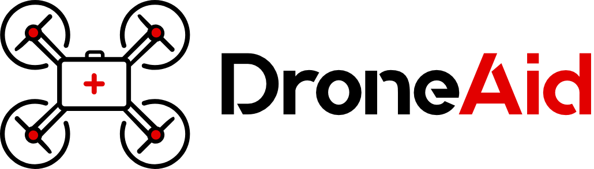
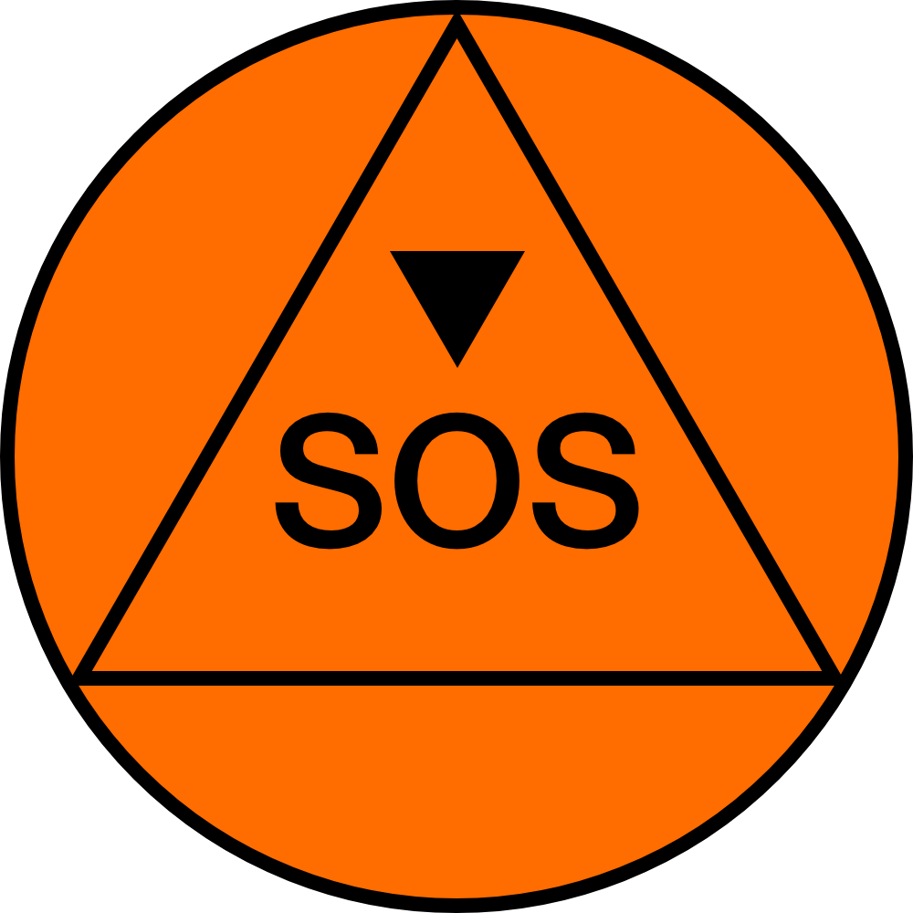
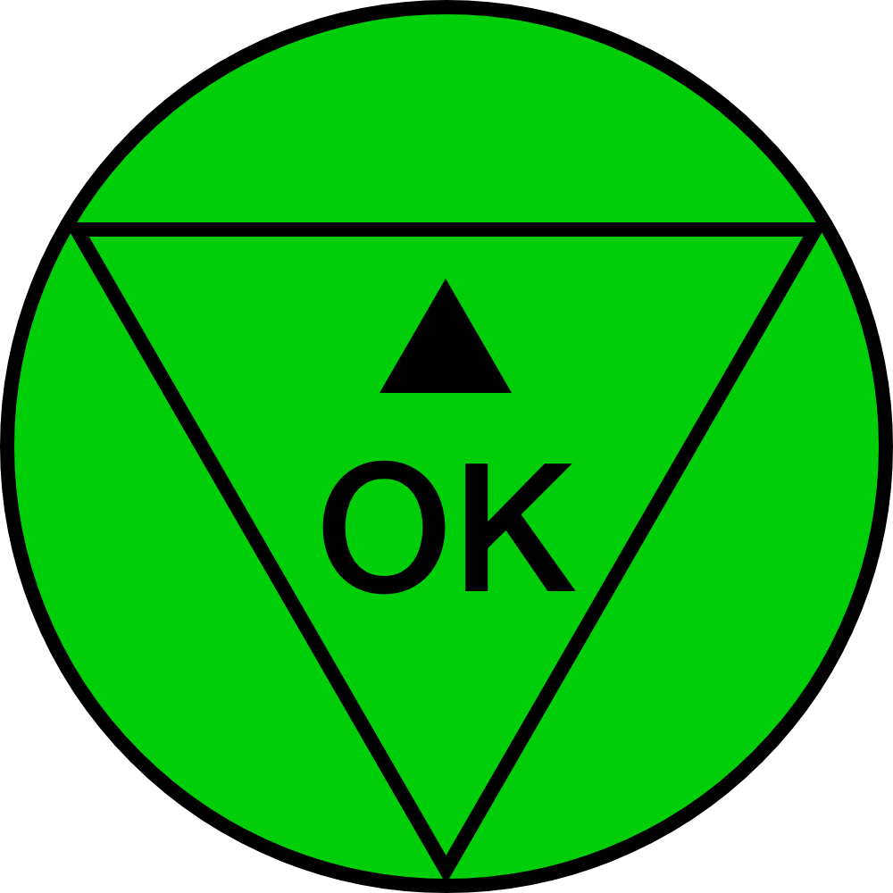
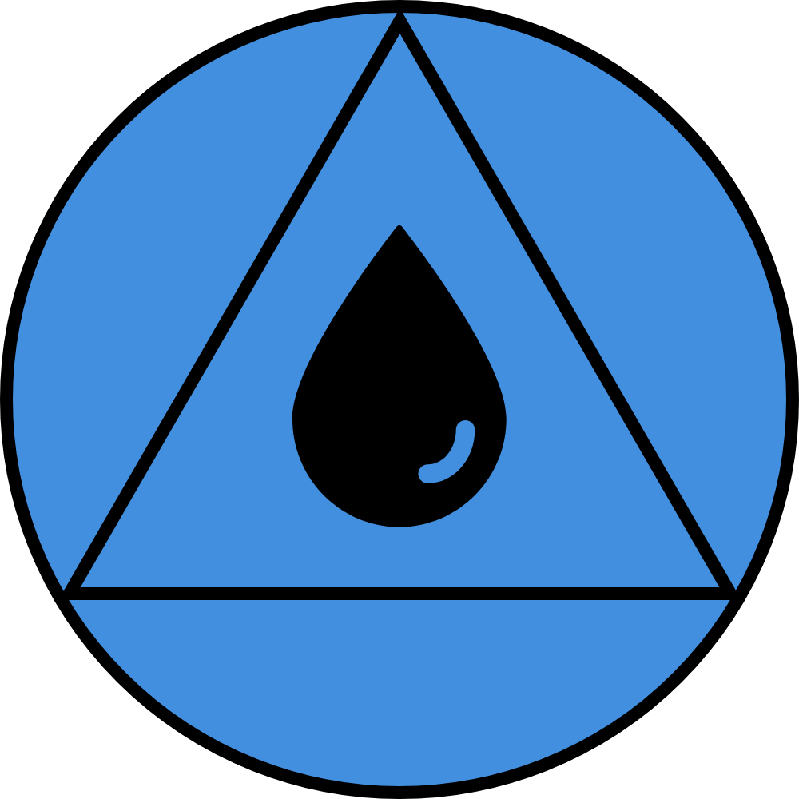
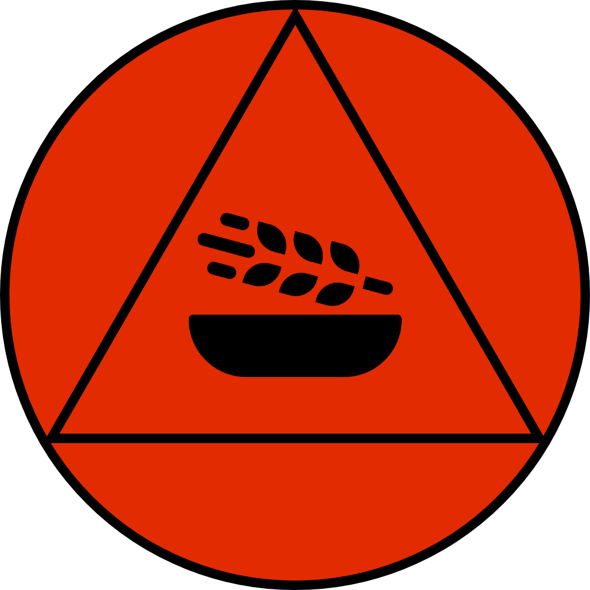
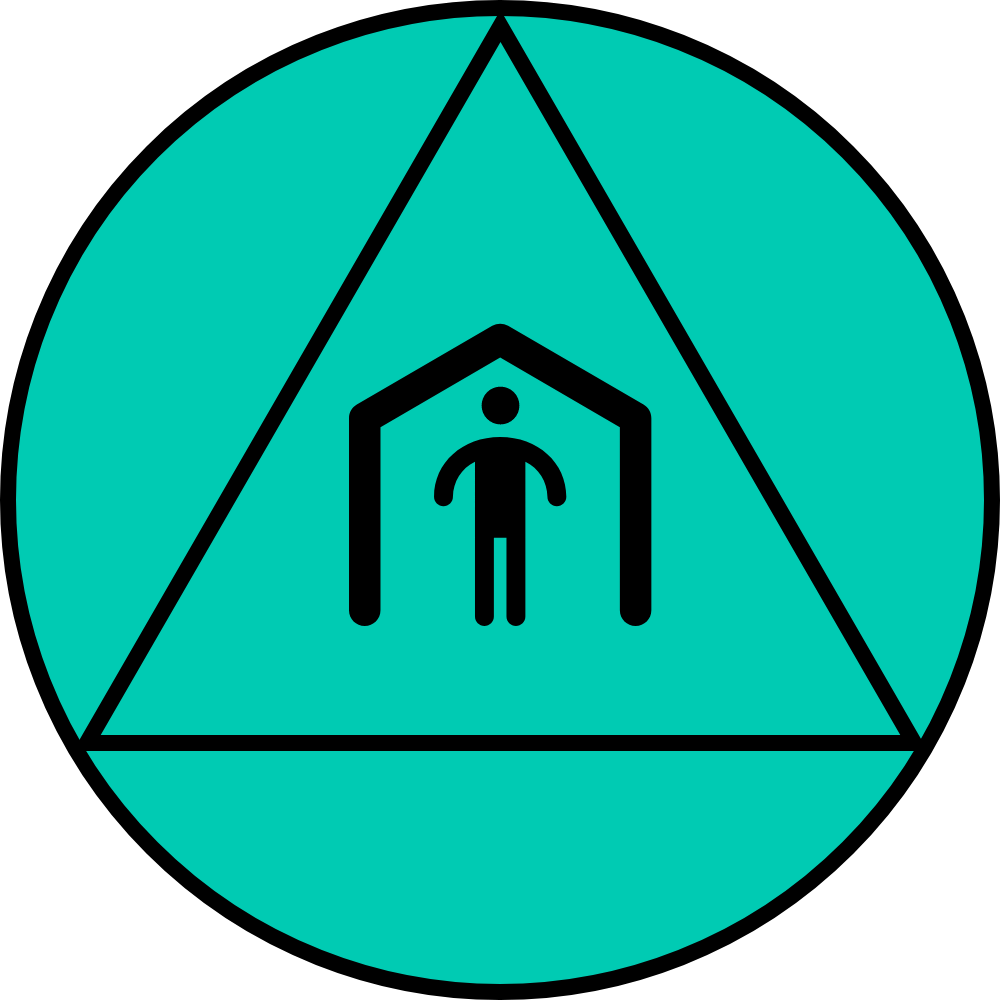
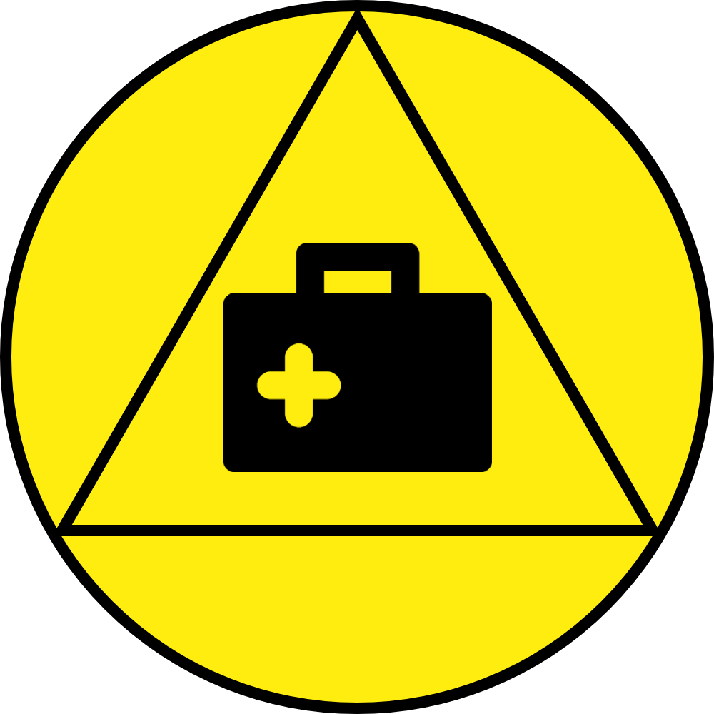
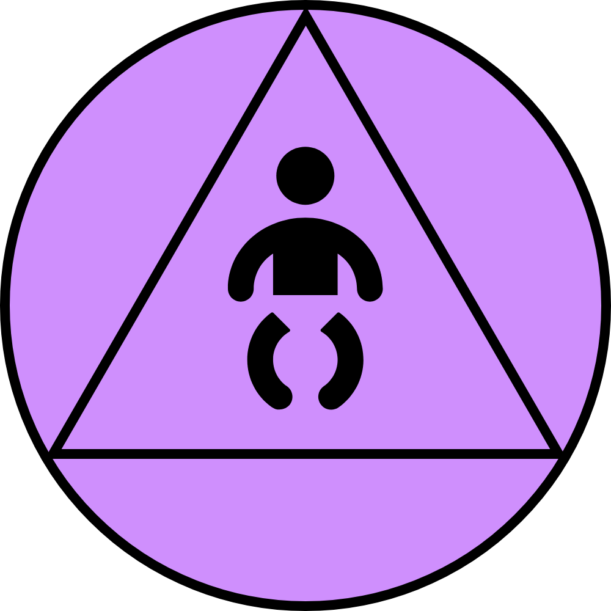
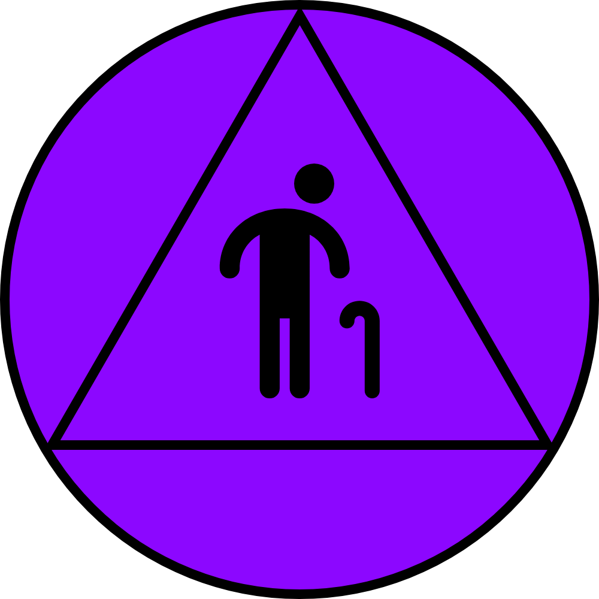
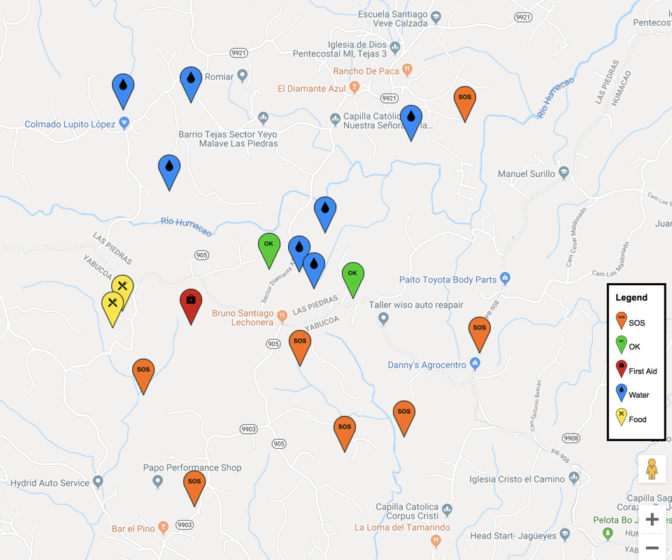

# DroneAid

## Creating a universal language to become the voice of millions.

 

DroneAid uses machine learning to detect calls for help on the ground placed by those in need.

# Design language

The DroneAid Design Language provides a way for those affected by natural disasters to express their needs to make them visible to drones, planes, and satellites when traditional communications are not available. 

Victims can use a pre-packaged symbol kit that has been distributed to them, or by using the standard itself to recreate the symbols manually with whatever materials they have available.

These symbols include those below, which can be used to provide.

| Symbol | Meaning |
|--------|---------|
|           | Immediate Help Needed           |
|  	        | No Help Needed                  |
|       | Water Needed                    |
|   	    | Food Needed                     |
|  	| Shelter Needed                  |
| | First Aid Kit Needed            |
| | Area with Children in Need      |
|  	| Area with Elderly in Need       |

# Machine learning

You can use the core DroneAid machine learning system by training a TensorFlow model or Watson Visual Recognition.

## With TensorFlow

You can implement the model yourself by training TensorFlow using these steps.

1. 
2. 
3. 

## With Watson Visual Recognition

You can implement the model yourself by training Watson Visual Recognition using these steps.

1. 
2. 
3. 

## With the Model Asset Exchange

Coming soon: You will be able to consume the pre-trained model as a Docker image.

# Plotting needs on a map

After recognizing the locations where needs have been detected, DroneAid can also plot the calls for help on a map.

